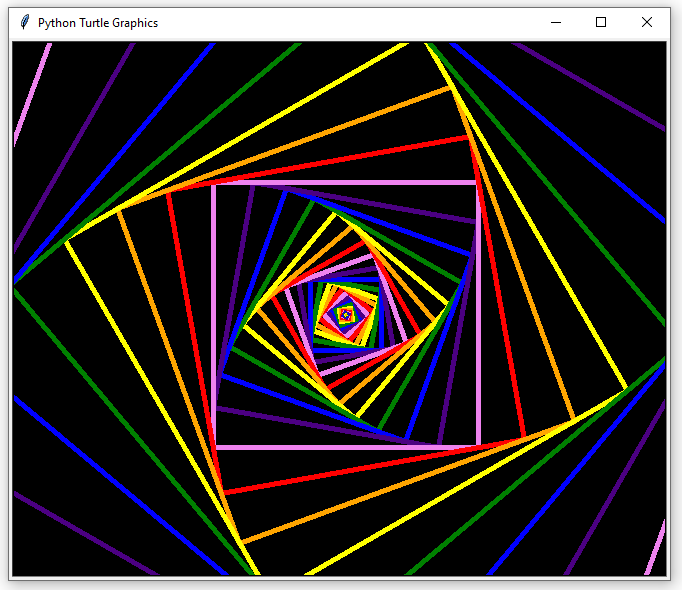
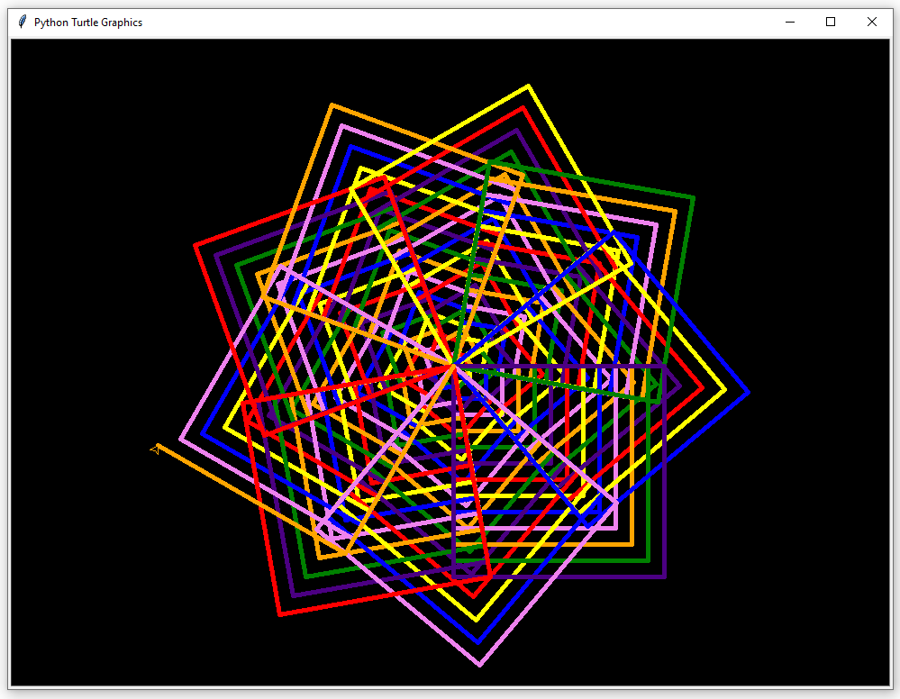
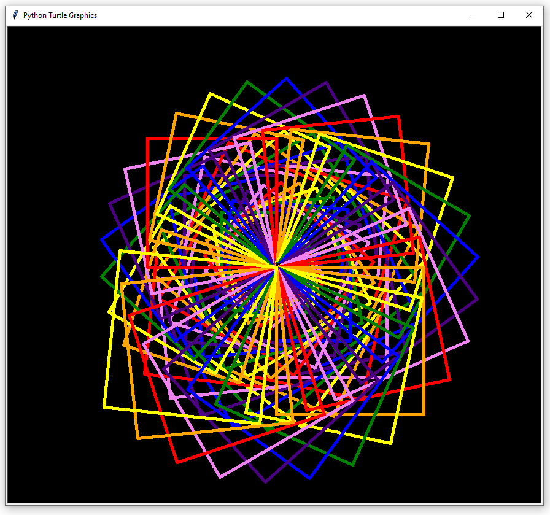

# Turtle Drawings

In this project, I experimented a little bit with the python module turtle. It allows you, to move one or more turtles in a window.
I only used one, removed the turtle so that only the trace of the turtle will be be displayed. I used different colours, too.
Using this module allows someone to learn the basics of object orientated programming in a simple and playful way.
Therefore, I highly recommend it to experiment with this module, if you're a beginner.

### Screenshots

- 
- 
- 
- 